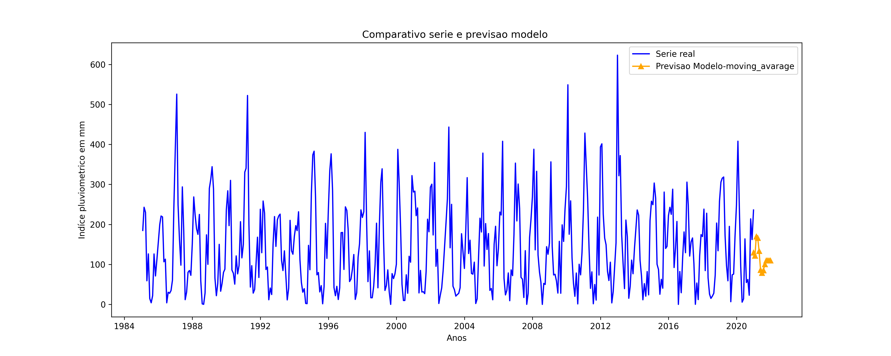

#Modelo da séries temporais -Auto_Arima
 **Objetivo*** Automatically discover the optimal order for an ARIMA model.  The auto-ARIMA process seeks to identify the most optimal parameters for an ARIMA model, settling on a single fitted ARIMA model. This process is based on the commonly-used R function, **forecast::auto.arima**

 ## Modelo Uitlizado

 - **pmdarima.arima.auto_arima**

 
 

### Série temporal estudada
1. Série temporal estudada
2. Série temporal

3. Transformação raíz cubica sobre a série
 
    3.1  Série transformada

4. Aplicação Modelo AUTO ARIMA

   4.1 Estudo dos resíduos
    
   4.2 Quantile-Quantile Plot-Rediduo -Modelo AR
    

   4.3 Autocorrelation Function-Resíduos -Modelo AR.
    

    4.4. Partial Autocorrelation Function -Resíduos- -Modelo AR.
    

5. Resultados

   5.1 Série e resíduos
   

   5.2 Previsão.
   

## **Análise compartiva de modelos.**
Está sessão tem como objetivorelizar uma análise comparativa dos modelos Autoregressivos, Moving Average,ARMA, ARIMA e Auto_ARIMA,  através das métricas erros.

* Previsão Modelo Autoregressivo

* Previsão Modelo Moving Average

* Previsão Modelo ARMA

* Previsão Modelo ARIMA
