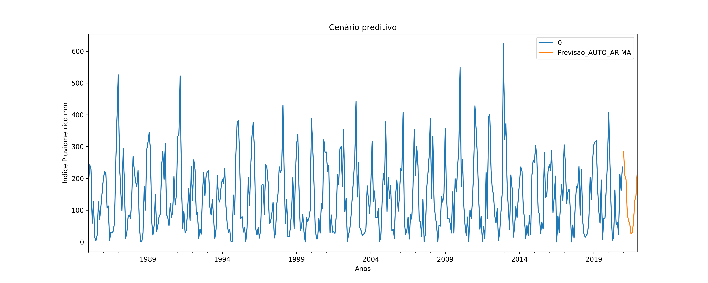

#Modelo da séries temporais -Auto_Arima
 **Objetivo*** Automatically discover the optimal order for an ARIMA model.  The auto-ARIMA process seeks to identify the most optimal parameters for an ARIMA model, settling on a single fitted ARIMA model. This process is based on the commonly-used R function, **forecast::auto.arima**

 ## Modelo Uitlizado

 - **pmdarima.arima.auto_arima**

 
 

### Série temporal estudada
1. Série temporal

2. Transformação raíz cubica sobre a série
2.1 Série transformada

3. Aplicação Modelo AUTO ARIMA
3.1 Estudo dos resíduos

3.2 Quantile-Quantile Plot-Rediduo -Modelo AR
 

3.3 Autocorrelation Function-Resíduos -Modelo AR.

3.4. Partial Autocorrelation Function -Resíduos- -Modelo AR.

4 Resultados

4.1 Série e resíduos

4.1 Previsão.
